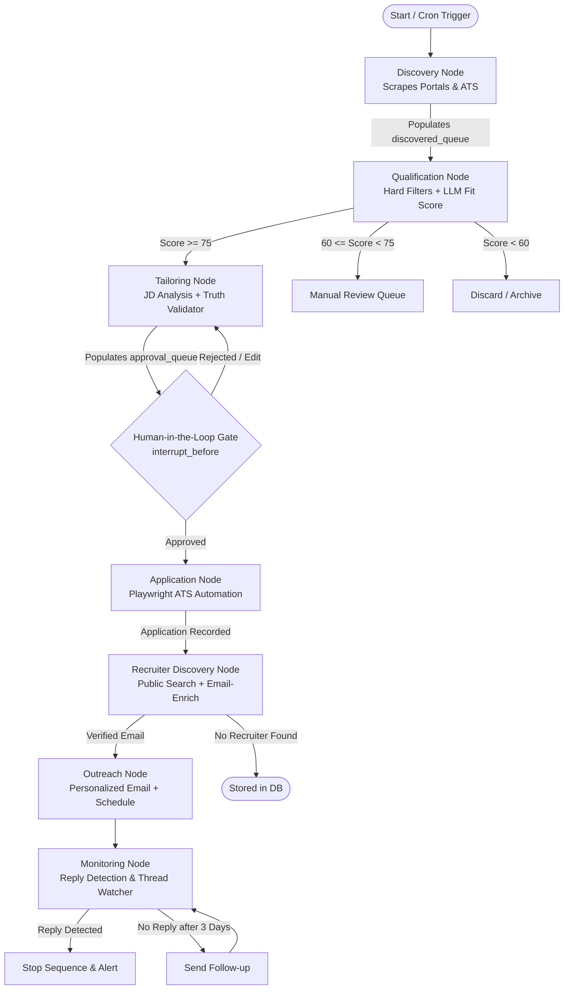

# Autonomous Job Hunter: Architecture, LangGraph State Machine & Skills Blueprint

> **Reference Context**: This document serves as the persistent system specification and architectural blueprint for the Job Hunter agentic platform. It survives conversation resets and context window limits.

---

## 1. System Philosophy & Learning Contract

1. **Role of AI (Observing & Teaching Agent)**: The AI assistant operates strictly as an **observing, guiding, and mentoring agent**. It does NOT autonomously run terminal commands or dump completed files behind the scenes. Instead, it instructs the user on what terminal commands to run, explains every line of code, presents function designs and schemas, and guides the user to write and understand the entire system manually.
2. **Pedagogical First**: No giant automated code dumps. Every component is designed iteratively with explicit explanations of *why*, *what*, and *how*.
3. **Deterministic State Graph (LangGraph)**: The orchestration uses **LangGraph** with explicit state transitions, queues for batch items, conditional branching, and checkpointing for human-in-the-loop approval.
4. **The Truth Layer (Zero Hallucination)**: LLM agents may rewrite and emphasize factual experiences from the candidate profile, but are strictly prohibited from fabricating tools, metrics, or credentials.
5. **Auditability**: Every application run creates an immutable snapshot (`applications/<id>/`) containing the exact JD, generated resume PDF, cover letter, form answers, and recruiter outreach logs.

---

## 2. LangGraph State Machine Architecture

The engine is modeled as a persistent, queue-driven **LangGraph StateGraph** backed by SQLite checkpointing (`SqliteSaver`).

### 2.1 State Graph Workflow



### 2.2 Core State Definition (`JobHunterState`)

```python
from typing import Annotated, Any, Dict, List, Optional
from typing_extensions import TypedDict
import operator

class JobHunterState(TypedDict):
    # Candidate Source of Truth
    master_profile: Dict[str, Any]
    answer_bank: Dict[str, Any]

    # Queues for State Transitions (accumulated via operator.add or custom reducers)
    discovered_queue: List[Dict[str, Any]]    # Raw scraped jobs
    qualified_queue: List[Dict[str, Any]]     # Jobs matching criteria (Fit >= 75)
    tailored_queue: List[Dict[str, Any]]      # Resume & Cover letter generated
    approval_queue: List[Dict[str, Any]]      # Awaiting human thumbs up
    application_queue: List[Dict[str, Any]]   # Ready for Playwright submission
    recruiter_queue: List[Dict[str, Any]]     # Applied jobs needing recruiter contacts
    outreach_queue: List[Dict[str, Any]]      # Verified recruiter emails scheduled
    monitoring_queue: List[Dict[str, Any]]    # Active sent emails awaiting replies

    # Execution Metadata
    active_job_id: Optional[str]
    current_step: str
    errors: Annotated[List[str], operator.add]
    audit_logs: Annotated[List[Dict[str, Any]], operator.add]
```

---

## 3. Component Architecture & Reused Modules

| Functional Domain | Cloned Reference (`upstream/`) | Target Package (`src/`) | Responsibilities |
| :--- | :--- | :--- | :--- |
| **Discovery** | `job-apply-mcp` + `HuntOS` | `src/discovery/` | Portal scrapers (Naukri, LinkedIn, Indeed), ATS scrapers (Greenhouse, Lever), Hiring intent calculation. |
| **Matching & Fit** | Custom LangGraph node | `src/matching/` | Tier 1: Hard filters; Tier 2: Semantic embedding match; Tier 3: LLM fit evaluation (0–100). |
| **ATS Tailoring** | `HuntOS` Typst/HTML | `src/tailoring/` | JD keyword extraction, controlled bullet rewriting, **Truth Validator**, single-column ATS PDF generator. |
| **Application** | `mr-jobs` + `job-apply-mcp` | `src/application/` | Playwright stealth automation, session cookie persistence, Application-Question Agent (Answer Bank). |
| **Recruiter Lookup**| `email-enrich` (TypeScript) | `src/recruiter/` (Python Port)| Pattern inference (`first.last`, `flast`), email permutator, async MX lookup + SMTP RCPT TO handshake. |
| **Outreach & Sync** | `Quickly` (FastAPI) | `src/outreach/` | Cold email sequencer, randomized morning send jitter, reply polling, thread tracking, automated stop switch. |
| **Orchestration** | LangGraph + SQLite | `src/graph/` | `StateGraph`, node definitions, conditional edges, `SqliteSaver` checkpointing. |
| **API & UI** | FastAPI + HTML/Tailwind | `src/server/` & `dashboard/` | REST endpoints for dashboard, approval queues, pipeline controls, funnel analytics. |

---

## 4. Master Data Schemas

### 4.1 Master Profile Contract (`data/master_profile.json`)
```json
{
  "personal": {
    "full_name": "...",
    "email": "...",
    "phone": "...",
    "linkedin_url": "...",
    "github_url": "...",
    "portfolio_url": "...",
    "location": { "city": "...", "country": "...", "remote_preference": "hybrid" }
  },
  "allowed_technologies": [
    "Python", "FastAPI", "PostgreSQL", "SQLite", "Docker", "Playwright", "LangGraph", "LangChain"
  ],
  "experience": [
    {
      "company": "...",
      "role": "...",
      "dates": { "start": "2023-01", "end": "Present" },
      "bullets": [
        { "id": "exp_1_1", "raw_fact": "Architected async microservice processing 10k events/sec using FastAPI and Redis." }
      ]
    }
  ],
  "projects": [
    {
      "id": "proj_1",
      "name": "Autonomous Agent",
      "tech_stack": ["Python", "Playwright", "LangGraph"],
      "bullets": [
        { "id": "proj_1_1", "raw_fact": "Built multi-agent workflow with state persistence and human approval gates." }
      ]
    }
  ],
  "skills_taxonomy": {
    "languages": ["Python", "SQL", "JavaScript", "TypeScript"],
    "frameworks": ["FastAPI", "React", "Playwright", "LangGraph"],
    "infrastructure": ["Docker", "Git", "PostgreSQL", "SQLite"]
  }
}
```

### 4.2 Application Snapshot Schema (`output/applications/<company_role_timestamp>/`)
* `job_spec.json`: Raw title, company, description, requirements, scraped metadata.
* `qualification.json`: Breakdown of hard filters, semantic match score, and LLM reasoning.
* `tailored_resume.pdf`: Clean single-column ATS PDF.
* `cover_letter.pdf`: 150–250 word targeted letter.
* `answers.json`: Recorded question-answer pairs submitted.
* `recruiter.json`: Identified recruiter name, title, inferred email, SMTP verification status.
* `outreach.json`: Email subject, body, sent timestamp, follow-up schedule, status (`SENT`, `REPLIED`, `STOPPED`).

---

## 5. Pedagogical Development Sequence (How We Build Together)

We follow an iterative, interactive building methodology:

1. **Step 1: Foundational Data & Truth Validator**
   - Design `master_profile.json` and Pydantic validation schemas.
   - Build `fact_validator.py` first to understand entity extraction and how to stop LLM hallucinations.
2. **Step 2: JD Parser & Controlled Resume Engine**
   - Write functions to extract keywords/skills from JD.
   - Build the bullet selection and rewriting prompt.
   - Render the ATS PDF using semantic HTML + Playwright.
3. **Step 3: Database & SQLite Models**
   - Write SQLAlchemy async models: `Job`, `Company`, `Application`, `Recruiter`, `EmailSequence`.
4. **Step 4: LangGraph State Machine & Queues**
   - Define `JobHunterState` and initialize `StateGraph`.
   - Implement nodes one by one with queue processing logic.
   - Wire up `SqliteSaver` and test human-in-the-loop breakpoints (`interrupt_before`).
5. **Step 5: Scrapers & Direct ATS Adapters**
   - Extract and adapt scrapers from `job-apply-mcp` (Naukri, LinkedIn, Indeed).
   - Write the Greenhouse & Lever Playwright automated form fillers.
6. **Step 6: Recruiter Discovery & Python Email-Enrich**
   - Port `email-enrich` logic to native Python (MX check, SMTP RCPT TO probe, pattern permutation).
7. **Step 7: Outreach Engine & Reply Polling**
   - Implement cold email scheduler, randomized send windows, and inbox reply monitoring.
8. **Step 8: FastAPI Endpoints & Visual Dashboard**
   - Connect FastAPI backend routes to inspect queues, approve pending applications, and trigger runs.
